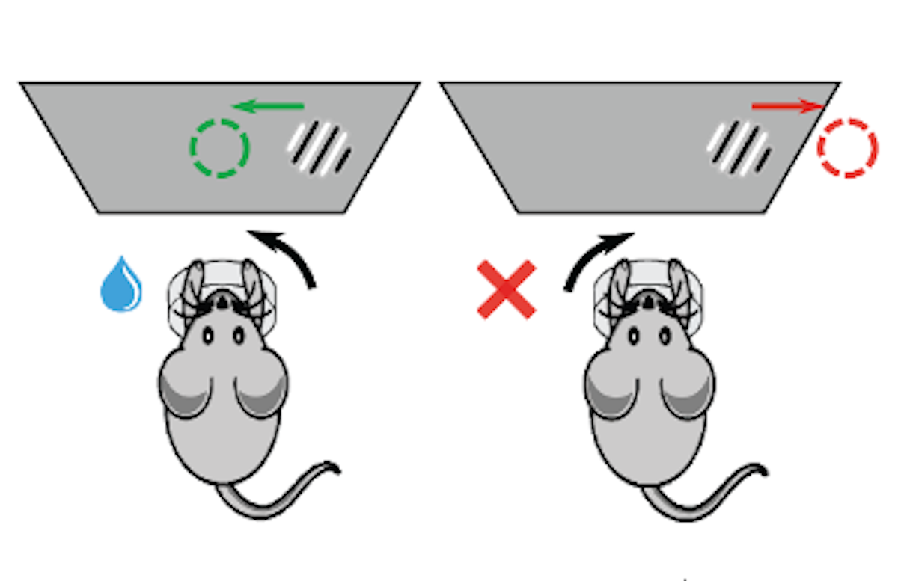
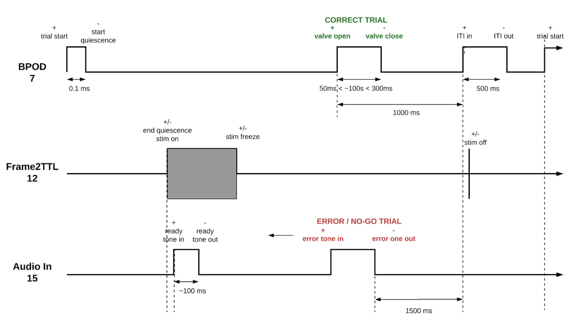
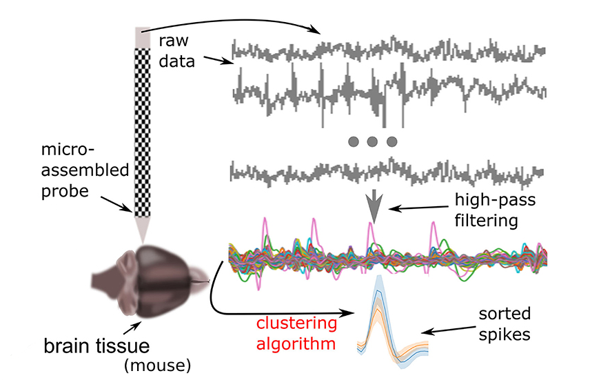
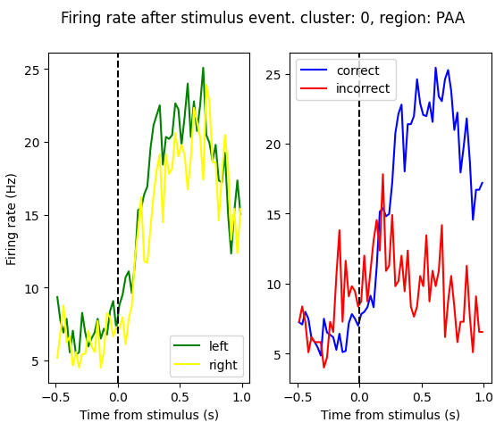
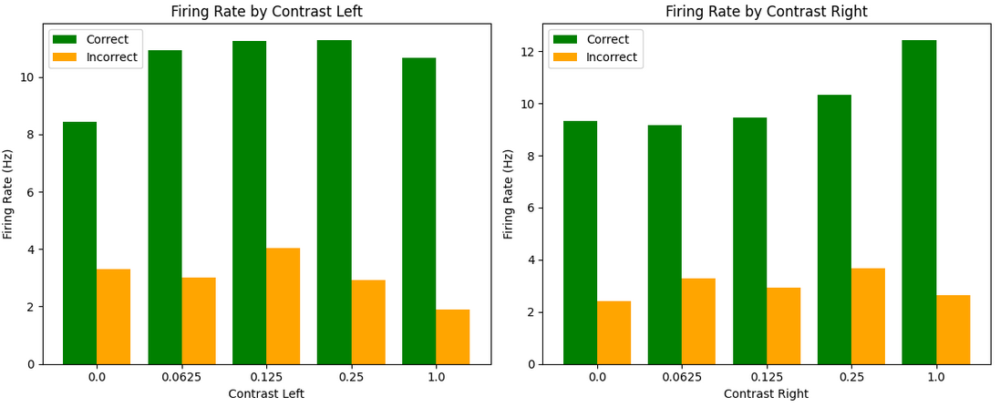
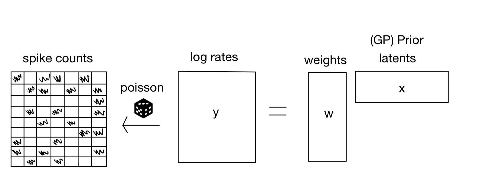
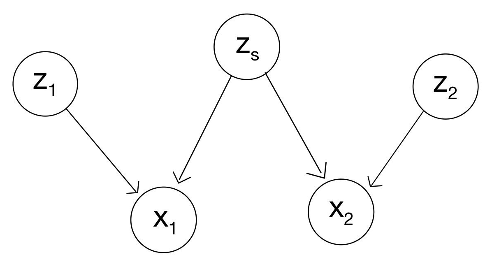
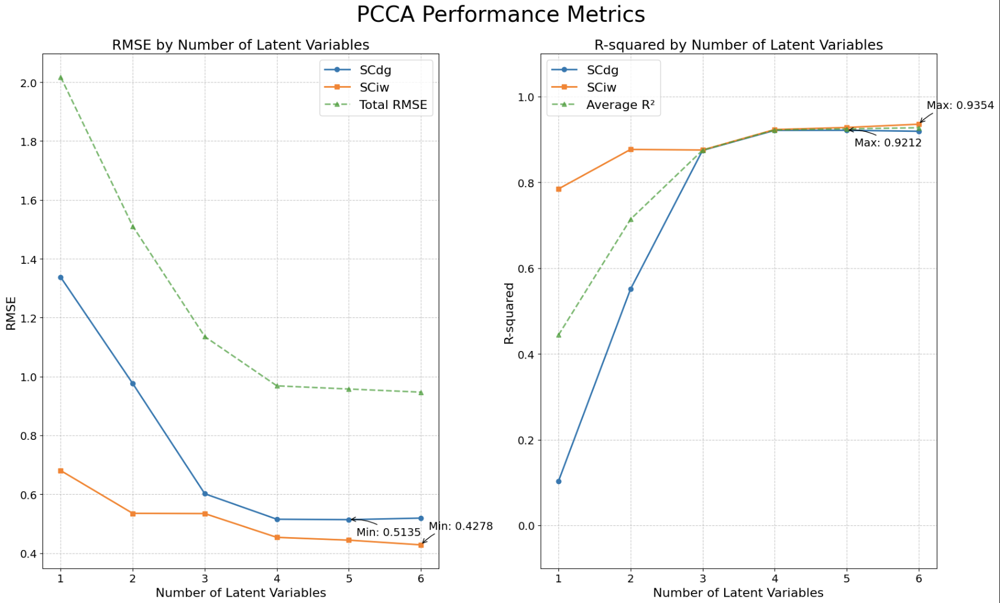

<!DOCTYPE html>
<html lang="en">
<head>
<meta charset="UTF-8">
<meta name="viewport" content="width=device-width, initial-scale=1.0">
<title>Neural Data Analysis Project</title>
<meta name="description" content="Exploration of neural population dynamics using variational models and canonical correlation analysis.">
<link rel="stylesheet" href="styles.css">

</head>
<body>
<header>
  <h2>Contents</h2>
  <nav>
    <ul>
      <li><a href="#introduction">Introduction</a></li>
      <li><a href="#modelHierarchy">Model Hierarchy</a></li>
      <li><a href="#results">Results</a></li>
      <li><a href="#conclusions">Conclusions</a></li>
    </ul>
  </nav>
</header>

<section id="team">
  <h2>Project Team</h2>
  
<strong>Mohamed Elshazly:</strong> <a href="mailto:melshazly@ucsd.edu">melshazly@ucsd.edu</a>

  
<strong>Nathen Lee:</strong> <a href="mailto:nal008@ucsd.edu">nal008@ucsd.edu</a>

  
<strong>Charlie Gillet:</strong> <a href="mailto:cgillet@ucsd.edu">cgillet@ucsd.edu</a>

  
<strong><u>Mentor</u> Mikio Aoi:</strong> <a href="mailto:maoi@ucsd.edu">maoi@ucsd.edu</a>

</section>

<section id="resources">
  <h2>Project Resources</h2>
  
<a href="https://drive.google.com/file/d/1wmj2dqI0WqJormsnmI2Z7EEZR3yiyErQ/view?usp=drivesdk">Written Report</a>

  
<a href="https://github.com/Charlie-279/LVM-Neural-Data-Analysis">Github Code Repository</a>

  
<a href="https://drive.google.com/file/d/11x849tWpzng_rFycxjG0shKsD8Jqqbwv/view?usp=drive_link">Project Poster</a>

</section>

<section id="introduction">
  <h2>Introduction</h2>
  
As methods for recording neural data advance rapidly in both volume and speed, neurophysiologists face increasing challenges in developing innovative techniques to assess and sort incoming spike signals (neuron firing rates) and inferring relationships between neural activities across different brain regions. We seek to create and utilize a method for extracting shared and independent latent features that accurately represent interpretable neural population dynamics across distinct brain regions.

  
The model we wish to construct builds on four main core components that serve as the foundation, allowing it to operate as we desire it to. These four components are: the Factor Analysis (FA) framework, the Auto-Encoding Variational Bayes (AEVB) framework, Probabilistic Canonical Correlation Analysis (pCCA), and Gaussian Processes (GPs). These components will be the key pieces used to build our two-step model pipeline that we will be inputting our data into: variational Latent Gaussian Process model (vLGP) and pCCA model. By using these core principles, our latent variable model will be able to extend the principles of factor analysis to extract latent representations within neural data to provide more interpretable firing rate dynamics than other current methods.

</section>

<section id="modelHierarchy">
  <h2>Model Hierarchy Pipeline</h2>
  <article id="IBLData">
    <h3>IBL Data</h3>
    
Using data collected by the International Brain Laboratory, we aim to analyze the latent behaviors of multiple regions of the brain in mice during standardized experiments. In these experiments, mice, with up to two probes recording 384 channels inserted into their brains, undergo a decision-making task where they are shown a stimulus of several different contrast strengths and is to move a wheel to center the stimulus on a screen. The IBL database contains large amounts of neural data (about 621,733 neurons) collected from 699 insertions of Neuropixel probes using 139 different mice over many experiment trials. These experiments give insight into regions and times in the brain that show sensitivity to stimulus, movement, reward, vision, and decision making.

    

        <figure>
                
                <figcaption>Fig.1 - The mouse performing the standardized experiment. The mice have up to two Neuropixel probes recording 384 channels inserted into their brains while completing this task.</figcaption>
        </figure>
        <figure>
                
                <figcaption>Fig.2 - The experiment timeline from start to finish using a behavioral control system, a visual stimulus system, and audio signals for feedback tones.</figcaption>
        </figure>
    

    
We will be using spike train data that have been presorted into the groups that present themselves as the sources of the voltage changes. These clusters are sometimes hard to identify as a single neuron, a cluster of neurons, or perhaps a mixture of noise from neighboring sources, so labels have been assigned (1 being a good cluster, 0 being bad/unclear) to each cluster recorded in a session. The spike trains from good clusters will be the main focus of our work in finding representative latent variables.

    

        
        <figcaption>Fig.3 - the sequence from capturing raw neural signals, performing high-pass filtering to refine the data, utilizing a clustering algorithm to analyze the signals, and finally sorting the spikes.</figcaption>
    

    
We seek to test firstMove, stimOn (and its contrast strength), and feedbackType. These represent the first movement of the mouse in each trial, the moment the stimulus appears on the screen, the strength of the contrast of the stimulus, and the reward/punishment the mouse receives after they make a decision, respectively. 

    

        <figure>
                
                <figcaption>Fig.5 - Peristimulus time histogram (PSTH) showing correct/incorrect and left/right firing rate averages over an entire session for a single cluster.</figcaption>
        </figure>
        <figure>
                
                <figcaption>Fig.6 - A bar graph showing correct/incorrect firing rate based on contrast strength averages over an entire session for a single cluster.</figcaption>
        </figure>
    

  </article>    
  
  <article id="vLGPModel">
    <h3>Variational Latent Gaussian Process (vLGP) Model</h3>
    
The first model our data will be put through is a variational Latent Gaussian Process (vLGP) model, which is primarily used in neuroscience to decode neural data into a more interpretable lower-dimensional latent space governed by Gaussian Processes. This model uses necessary imports from essential libraries such as NumPy, SciPy, Matplotlib, and the vLGP-specific library developed by Yuan Zhao and Il Memming Park to handle computations and visualizations.

    
    <figcaption>Fig.7 - Variational Latent Gaussian Process</figcaption>
  </article>
  
  <article id="pCCAModel">
    <h3>Probabilistic Canonical Correlation Analysis (pCCA) Model</h3>
    
Following the vLGP processing is the probabilistic Canonical Correlation Analysis (pCCA) model. After the IBL data is collected and cleaned, it will be first put through the vLGP model to smoothen and move the data to a lower-dimensional latent space. Then, the vLGP model's output is used as the input to the pCCA model in order to conduct the analysis. In the field of neuroscience, pCCA is typically used to model latent variables that explain the variability between two or more modalities of data, which helps to understand complex neural dynamics.

    
    <figcaption>Fig.8 - Probabilistic Canonical Correlation Analysis Visualization</figcaption>
  </article>
</section>

<section id="results">
  <h2>Results</h2>
  <strong>Superior Colliculus Intermediate White Layer (SCIW)</strong>: Contains fiber tracts that connect various layers within the superior colliculus and link it with other brain regions. While not directly processing sensory inputs, it facilitates the transmission of motor commands that underlie orienting responses and visually guided actions.

  
 
  <iframe src="assets/sciw_movement_plot.html" style="width: 200%; height: 200%;" frameborder="0"></iframe>
  <figcaption>Fig.9 - SCIW</figcaption>
  

   
  <strong>Superior Colliculus Deep Grey Layer (SCDG)</strong>: Involved in triggering complex motor responses, particularly those related to defensive or escape behaviors. Contributes to the coordination of multisensory inputs into appropriate motor outputs, such as rapid turning or withdrawal movements in response to threats

  
 
  <iframe src="assets/scdg_stimulus_plot.html" style="width: 200%; height: 200%;" frameBorder=0></iframe>
  <figcaption>Fig.10 - SCDG</figcaption>
  

</section>

<section id="conclusions">
  <h2>Conclusions</h2>
  
Root Mean Square Error measures the average difference between predicted values and actual values. The graph displays an initial steep decline, reaching its lowest at variable 3 and then stabilizing, suggesting strong improvement from 1 to 3 latent variables but diminishing returns in RMSE improvement with more than 3 latent variables.

  
R-squared is the coefficient of determination and measures the proportion of variance explained by the latent variables in the PCCA model, or simply put, signifies how well the data fits the model. The graph displays a rapid increase, stabilizing after 3 latent variables, indicating a strong fit of the model to the data when more latent variables are utilized, especially beyond 3 variables.

  
  <figcaption>Fig.11 - Root Mean Squared Error (RMSE) and R-squared</figcaption>
</section>

</body>
</html>
