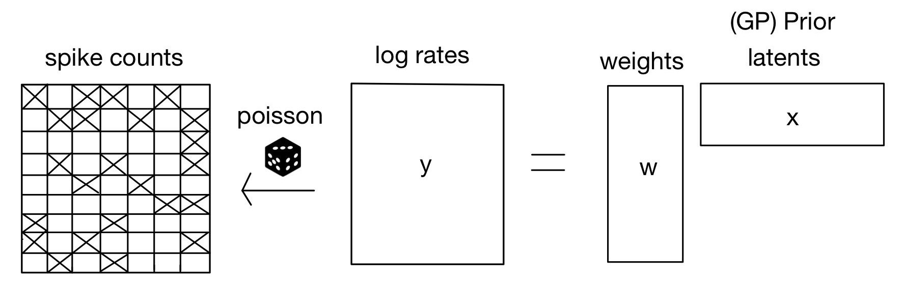

 

Mohamed Elshazly: melshazly@ucsd.edu

Nathen Lee: nal008@ucsd.edu

Charlie Gillet: cgillet@ucsd.edu

Mentor: Mikio Aoi maoi@ucsd.edu

<a href="https://drive.google.com/file/d/1wmj2dqI0WqJormsnmI2Z7EEZR3yiyErQ/view?usp=drivesdk">Written Report</a>
 
<a href="https://github.com/Charlie-279/LVM-Neural-Data-Analysis">Github Code Repository</a>
 
<a href="https://drive.google.com/file/d/11x849tWpzng_rFycxjG0shKsD8Jqqbwv/view?usp=drive_link">Poster</a>

## Introduction

As methods for recording neural data advance rapidly in both volume and speed, neurophysiologists face increasing challenges in developing innovative techniques to assess and sort incoming spike signals (neuron firing rates) and inferring relationships between neural activities across different brain regions. We seek to create and utilize a method for extracting shared and independent latent features that accurately represent interpretable neural population dynamics across distinct brain regions.

The model we wish to construct builds on four main core components that serve as the foundation, allowing it to operate as we desire it to. These four components are: the Factor Analysis (FA) framework, the Auto-Encoding Variational Bayes (AEVB) framework, Probabilistic Canonical Correlation Analysis (pCCA), and Gaussian Processes (GPs). These components will be the key pieces used to build our two-step model pipeline that we will be inputting our data into: variational Gaussian Process Factor Analysis model (vGPFA) and probabilistic Canonical Correlation Analysis (pCCA) model. By using these core principles, our latent variable model will be able to extend the principles of factor analysis to extract latent representations within neural data to provide more interpretable firing rate dynamics than other current methods.

## Model Hierarchy Pipeline

### IBL Data

Using data collected by the International Brain Laboratory, we aim to analyze the latent behaviors of multiple regions of the brain in mice during standardized experiments. In these experiments, mice, with up to two probes recording 384 channels inserted into their brains, undergo a decision-making task where they are shown a stimulus of several different contrast strengths and is to move a wheel to center the stimulus on a screen. The IBL database contains large amounts of neural data (about 621,733 neurons) collected from 699 insertions of Neuropixel probes using 139 different mice over many experiment trials. These experiments give insight into regions and times in the brain that show sensitivity to stimulus, movement, reward, vision, and decision making.

<figure>

        
        <figcaption>Fig.1 - IBL Mouse Experiment</figcaption>

</figure>

<figure>

        
        <figcaption>Fig.1 - IBL Mouse Experiment</figcaption>

</figure>

<figure>

        
        <figcaption>Fig.1 - IBL Mouse Experiment</figcaption>

</figure>

<figure>

        
        <figcaption>Fig.1 - IBL Mouse Experiment</figcaption>

</figure>

### Variational Latent Gaussian Process (vLGP) Model

The first model our data will be put through is a variational Latent Gaussian Process (vLGP) model, which is primarily used in neuroscience to decode neural data into a more interpretable lower-dimensional latent space governed by Gaussian Processes. This model uses necessary imports from essential libraries such as NumPy, SciPy, Matplotlib, and the vGPFA-specific library developed by Yuan Zhao and Il Memming Park to handle computations and visualizations.

<figure>

        
        <figcaption>Fig.1 - IBL Mouse Experiment</figcaption>

</figure>

### Probabilistic Canonical Correlation Analysis (pCCA) Model

The next and final step of our pipeline involves a probabilistic Canonical Correlation Analysis (pCCA) model. After the IBL data is collected and cleaned, it will be first put through the vGPFA model to smoothen and move the data to a lower-dimensional latent space. Then, the vGPFA model's output is used as the input to the pCCA model in order to conduct the analysis. In the field of neuroscience, pCCA is typically used to model latent variables that explain the variability between two or more modalities of data, which helps to understand complex neural dynamics.

<figure>

        
        <figcaption>Fig.1 - IBL Mouse Experiment</figcaption>

</figure>

<figure>

        
        <figcaption>Fig.1 - IBL Mouse Experiment</figcaption>

</figure>

## Results
Superior Colliculus Intermediate White Layer (SCIW): Contains fiber tracts that connect various layers within the superior colliculus and link it with other brain regions. While not directly processing sensory inputs, it facilitates the transmission of motor commands that underlie orienting responses and visually guided actions.

<iframe src="assets/sciw_movement_plot.html" width=800 height=600 frameBorder=0></iframe>

Superior Colliculus Deep Grey Layer (SCDG): Involved in triggering complex motor responses, particularly those related to defensive or escape behaviors. Contributes to the coordination of multisensory inputs into appropriate motor outputs, such as rapid turning or withdrawal movements in response to threats

<iframe src="assets/scdg_stimulus_plot.html" width=800 height=600 frameBorder=0></iframe>

## Conclusions

<figure>

        
        <figcaption>Fig.1 - IBL Mouse Experiment</figcaption>

</figure>

Root Mean Square Error measures the average difference between predicted values and actual values. The graph displays an initial steep decline, reaching its lowest at variable 3 and then stabilizing, suggesting strong improvement from 1 to 3 latent variables but diminishing returns in RMSE improvement with more than 3 latent variables.

R-squared is the coefficient of determination and measures the proportion of variance explained by the latent variables in the PCCA model, or simply put, signifies how well the data fits the model. The graph displays a rapid increase, stabilizing after 3 latent variables, indicating a strong fit of the model to the data when more latent variables are utilized, especially beyond 3 variables.